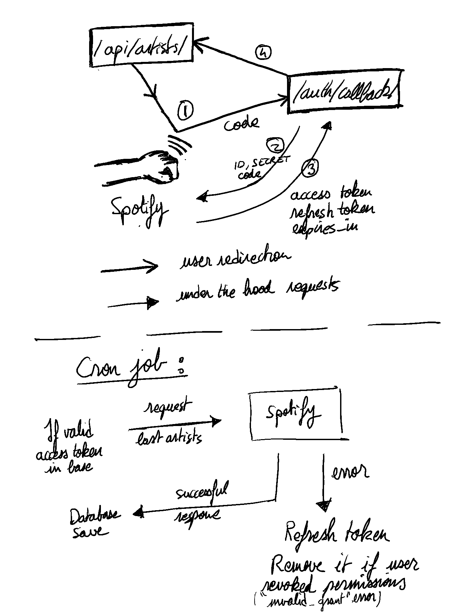

## Implementation

I decided to do a one user project, meaning no authentication is required to access /api/artists/.
When the user - probably you reading this text :) - requests this endpoint, a few steps described below happen until he gets redirected to the first endpoint where the artists will be displayed. Theses steps retrieve the access token.

Meanwhile, a cron job (django-crontab package), regularly fetches artists if an access token is valid in base.




## Running the project 
(use "setx CLIENT_ID=<..>" on windows)
```
export CLIENT_ID=<your_client_ID>
export CLIENT_SECRET=<your_client_secret>
```
then 
```
docker-compose up
```

Hit http://localhost:5000/api/artists/ with your browser and you should see the artists from new releases (not all at first, the cron task execute every minute)

## More

The production settings file (spotify_fetcher/settings/production.py) basically set DEBUG to False and seek for a SECRET_KEY env variable to replace the default secret key used in development. 
Maybe you'll want to do:
```
export SECRET_KEY=<your_secret_key>
```
Statics files are served at "/static/" and generated with "python manage.py collecstatic" (see the Dockerfile).


Django deployement using Gunicorn server.

Docker related: I used a python image on which i installed cron. I used docker-compose to create a postgres container that launch before the django one. I wait a solid 3 sec when the django container starts before executing django in order to be quite certain the postgres db is ready. A better way to do this would be to request at regular interval a postgres container endpoint to check get its state.